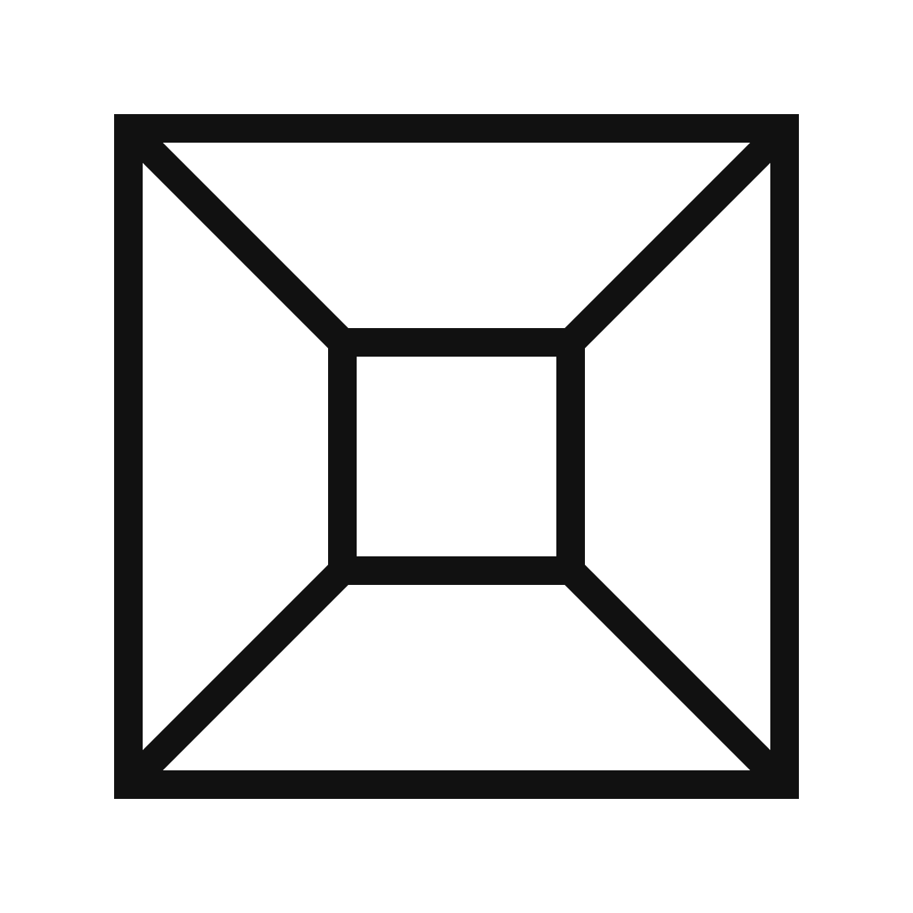

# FoldKernel

  

FoldKernel is a deterministic protocol engine for generating verifiable coherence artifacts.

It defines the mathematical and cryptographic rules used by the Fold coherence instrument to transform structured interaction into reproducible symbolic artifacts.

The kernel contains no user interface, rendering system, or application logic.
It exists purely as protocol infrastructure.

FoldKernel guarantees that identical interaction histories always produce identical artifacts.
This determinism allows Fold artifacts to be independently reproduced, verified, and interpreted across different implementations.

The protocol implements the following deterministic pipeline:

interaction
→ permutation events
→ memory signature
→ convergence hash

From this pipeline, higher-level systems can derive symbolic representations such as sigils or registry artifacts without altering the underlying protocol.

FoldKernel is intentionally minimal and stable.
Exploration layers, visualizations, and interaction vessels are built on top of the kernel rather than inside it.

---

## Components

FoldKernel provides:

• permutation validation
• canonical square definition
• D4 symmetry orbit
• adjacency graph derivation
• arithmetic invariant evaluation
• canonical distance metric
• structural convergence detection
• stateless memory encoding
• keccak-256 hash derivation

---

## Deterministic Guarantees

For any identical sequence of events:

• the memory signature will be identical  
• the convergence hash will be identical  
• artifacts are reproducible across machines  

FoldKernel contains no randomness, timestamps, or external dependencies.

---

## Version

Current protocol version:

FoldKernel-1.0.0

The protocol version is embedded directly into artifact hashes.

Future revisions will increment this identifier.

---

## Architecture

FoldKernel is designed to be used by higher-level systems:

FoldKernel → protocol  
Instrument → interaction vessel  
SigilEngine → artifact interpretation

This repository contains only the protocol layer.

---

## Identity

The FoldKernel mark is a load-bearing plan: an outer protocol boundary folds
inward around a protected canonical kernel. Its four equal paths express the
symmetry, deterministic transformation, and structural convergence implemented
by the protocol.

The canonical mark and production variants are maintained in
[`Assets/Brand`](Assets/Brand/README.md).

---

## License

MIT License
